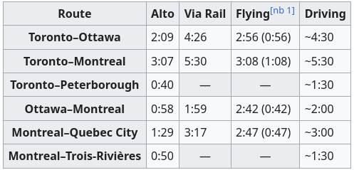
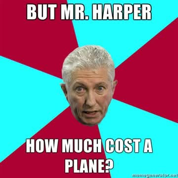

+++
title = "Alto"
date = 2026-03-29

[extra]
toc = true
+++

# Introduction

Lately, it seems like many people in my town (and the wider province) are
discussing the [Alto](https://www.altotrain.ca/en) project. My general
impression from those conversations is one of high skepticism, at best. Between
concerns about cost, environmental impact, land expropriation, urban-rural
divides, corruption, and maybe some simple NIMBYism, there are a lot of
different angles to consider from the "no" camp. I find myself with thoughts,
which you're about to read (stop while you can).

# The "Nots"

To be clear, I'm not against high-speed rail (HSR) as a concept. I think that
serious and iterative commitment to building and improving public services -
including infrastructure - is something that we are sorely missing as a society.
A regional or even coast-to-coast HSR network is a transformative example of
this, and it would dramatically alter the lives of nearly everyone across this
land, often in unexpected ways. I find the lack of creativity in the public
discourse about Alto very frustrating, but while I suspect that contrarianism
plays a big part, it seems clear that there are valid concerns about it. So,
this article is **not**:

- A dismissal of the benefit to the vast majority of people in the urban centers
  which would receive stations;
- A suggestion that any opposition should stop research and development of such
  projects;
- Ignorance towards historically exploitative, dismissive, and otherwise one-way
  relationships between Canada and First Nations regarding land use, resource
  extraction, and other obligations, the trends of which this project will
  probably continue (even though it mentions consultations are ongoing);
- One of the usual arguments like "the country is simply too big", "it's too
  cold here for the trains to work", "it'd cost too much", and so on. These are
  solved problems in other parts of the world. We don't need to keep pretending
  we're on our own;
- A partisan position, i.e. opposition because the former PM and/or the team
  wearing red gets credit;
- Me pretending that I'm unbiased.

Let's get into it.

# The Back of the Envelope

## Ottawa to Toronto, for the Weekend (Round Trip)

Here come some numbers for an example trip, using these assumptions:

- The trip is assumed to begin on Friday, September 25th, 2026 (about six months
  from now). We're planning well in advance.
- Where possible, these numbers were obtained by searching for flights and
  trains via Google, using results for Westjet and VIA Rail, respectively. 
- Fuel cost assumes there and back, plus some city driving, in a mid-sized SUV.
  It's probably closer to $200 at current per-litre costs.
- **The train and flight ticket prices are for a single adult** - for a family,
  driving is by far the most affordable option.
- Time spent for the car assumes at least one short stop to stretch, use the
  washroom, etc., while for the flight it assumes you're at the airport at least
  an hour before departure. The train is simplest here.

| Item                                     | Car               | Train        | HSR           | Flight        |
| ---------------------------------------- | ----------------- | ------------ | ------------  | ------------- |
| Fuel Cost (CAD)                          | 150               | X            | X             | X             |
| Ticket Cost (CAD)                        | X                 | 161          | **?**         | 493           |
| Other Costs (e.g. bus, subway, in CAD)   | X (optional)      | 25           | 25            | 25            |
| Time Spent (hours, one way)              | 5                 | 4.5          | 2             | 3             |
| Attention                                | Occupied          | Free         | Free          | Free          |

It goes without saying that **all** of these options are expensive for someone
earning the median or average incomes (using [2023
numbers](https://www150.statcan.gc.ca/t1/tbl1/en/tv.action?pid=1110023901)) of
$45,400 or $59,400 per year, respectively, so it's easy to understand how
critics would perceive this project to be by and for a much wealthier
demographic. I don't see any indication that the Alto project is intended to
solve this problem of access (but more on that in a bit). There are also hidden
factors baked into those options to consider - for example, unless you use a
carsharing service like [Communauto](https://ontario.communauto.com/), the first
option means you need to own and maintain a vehicle, which is a frustrating and
expensive barrier-to-entry for people to access many modes of living. When
climate and environmental consequences are considered, all of them tend to look
even worse (although if Alto or standard trains were electrified, that'd be a
point in their favour). For comparison, here's table [from
Wikipedia](https://en.wikipedia.org/wiki/Alto_(high-speed_rail)#Travel_times) showing
estimated times:

## What Will an Alto Fare Cost?

I think that this is potentially the single most important question to be asked
about this project. By extension, once all of the sacrifices are made despite
myriad objections, will anyone actually be able (or want) to use it?  

Looking at the table from earlier and considering **only** the raw time ratios
(2.25 and 1.5 for train/HSR and flight/HSR, respectively), the HSR fare can be
at most about **$362** for a single adult. The problem with this line of
thinking, however, is that VIA Rail services would almost certainly become
unviable once Alto was complete - their 2023 [annual
report](https://media.viarail.ca/sites/default/files/publications/397_034_VIARAIL_ANNUAL-REPORT-2023.pdf)
mentions that **96%** of passenger trips were taken along the Quebec
City-Windsor corridor - so the 1.5x multiplier from the flight comparison is
more apt, meaning an HSR fare for a single adult in our round-trip hypothetical
could be a whopping **$739**, while remaining "appealing" compared to a flight.
It's unlikely that the time ratio is the only factor that goes into the price,
though, and more importantly the argument falls apart pretty quickly with access
to "cheap" fuel and a vehicle if you actually want to minimize your travel
budget. Will these be the case in 20 years when Alto is up and running? Hard to
say, but for now other forms of transportation are really expensive. Unless
costs come down across the board, I don't see how Alto is going to be any more
appealing than the decision to drive, even if it means taking 2.5 times as long
(or more, with rush hour traffic).

## A European Comparison

TBD

## Imagining: A $20 Fare?

It's worth repeating: **public services should not be expected to turn a
profit**. That doesn't mean we should be careless with expenditures, but instead
of letting profit be the deciding factor, we need to look such programs in terms
of how they let people lead more fulfilling lives. We know that Alto is expected
to service roughly half of the country's population

# Ecologies and Borderization

## The Energy Dilemma

- more of the same means more dependency on diesel and thus oil - what room is
  there to consider building brand new infrastructure on this? There is an
  argument to be made that we're already a decade or two behind the curve for
  electrifying national infrastructure
- Note that the project won't be done for 20 years - what is the safest energy
  source to bet on with that time horizon? Probably not anything oil-based

  TBD

## Roads (and Rails) as Borders

- Necropolitical look at the road and railway as a border, borderization effect,
  danger/death association
  - HSR is a more extreme example because of speed, electricity, more stringent
    safety requirements
- Further fragmentation of already disconnected ecosystems, communities
- How do we elevate it? Are there new designs that solve some of these issues?

TBD

# Degrowth and Taking Things Slower

TBD

# Closing Thoughts

# WIP Notes/Questions

- Electrification usually means fenced-off railways even for non-HSR services -
  same challenges as any other long-distance power delivery. European rail lines
  use a variety of configurations such as 25kV and 15kV AC, with some lower
  (e.g. 750V DC) standouts too. Safety protocols/regulations tend to require
  this to be fenced off, so the bisection problem for new infrastructure
  persists in this case. Need good citations (see
  [here](https://en.wikipedia.org/wiki/Railway_electrification#Classification)).
  Possibly Metrolinx (Ontario)?
- What does it cost to build new track, new trains?
- What other global services could be used as inspiration?
- VIA Rail [annual
  report](https://media.viarail.ca/sites/default/files/publications/397_034_VIARAIL_ANNUAL-REPORT-2023.pdf)
  suggests $430 million revenue, $382 million operating loss in 2023
  - If we wanted to sustain the current infrastructure, expand it, and make it
    more affordable (e.g. $10, $20 fares per person), how many years (decades)
    would the current proposed costs for Alto HSR sustain it?
