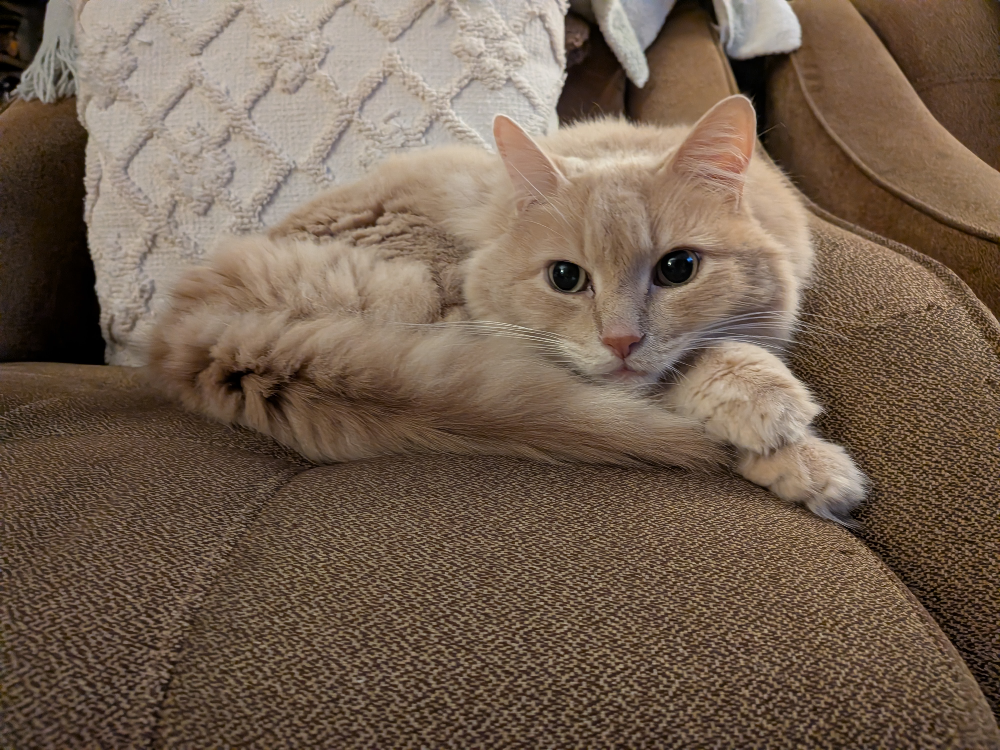

+++
title = "Backyard Ecology: Fauna"
date = 2025-12-20
+++

## Introduction

2025 was a busy year, and few of the ecological study ideas laid out in
my [previous post](@content/posts/backyard_ecology_ideas/index.md) got
implemented. However, we have taken to the millenial memetic trend of
birdwatching, and as of writing this we have three bird feeders around
the house. We've been enthusiastically keeping track of their usage
since the spring, noting the coming and going of different species of
birds (and squirrels), and making sure to fill them regularly so that
the birds know to keep visiting. The highlight of 2025 was probably
seeing three blue jays at once, hanging around the big (and
coincidentally, also blue!) feeder near the back deck.

This got me thinking about more formally tracking the species we see and
comparing them against currently understood ranges. When I was younger, I
had a hardcover edition of the book [Reader's Digest North American
Wildlife](https://www.simonandschuster.ca/books/North-American-Wildlife/Readers-Digest/Readers-Digest/9781606524916),
which I poured over obsessively - particularly the sections on sharks -
in the way only a nerdy kid can. I picked up a newer edition a while
back, but only recently remembered I had it, and I figured it'd be a good
starting point. At the very least, it would be a reference I could use
to speculate on changing ecologies in the area.

## Caveats

Our birding observations are pretty qualitative, and there are some
other limitations to keep in mind:

1. Tracking exact population numbers of different species is going to be
   hard, beyond noting the maximum number of the same species seen at
   one time;
2. Some animals may come and go, whether seasonally, because of other
   opportunities, territorial changes, predation, or other factors. For
   example, it seems we've barely seen any of the slightly larger birds
   since the first major snowfall, despite the feeder being filled;
3. The type of feed we fill the feeders with may limit which kinds of
   birds appear at all - for example, at first we used exclusively
   sunflower and saw mostly grackles and mourning doves, but now we
   don't see the latter.

Most of this data will be from Wikipedia for now - eventually I'll get
pictures of the actual animals. I'll also make a point to come back and
update it as things change.

## Birds

| Name                                                                             | Image                                                                                                | Quantity | Comments                       |
| -------------------------------------------------------------------------------- | ---------------------------------------------------------------------------------------------------- | -------- | ------------------------------ |
| [Blue Jay](https://en.wikipedia.org/wiki/Blue_jay) |  | 3+        | Possibly more than this number |
| [Northern Cardinal](https://en.wikipedia.org/wiki/Northern_cardinal) |  | 2+ | Mated pair, present since at least 2024 |
| [Common Grackle](https://en.wikipedia.org/wiki/Common_grackle) | | 5+       | Originally had monopoly on feeder; helped mourning doves with feeding. Moved on after seed change |
| [Mourning Dove](https://en.wikipedia.org/wiki/Mourning_dove) |  | 4+ | One may have been taken by a neighbourhood cat |
| [American Goldfinch](https://en.wikipedia.org/wiki/American_goldfinch) |  | 5+ | Hard to track, very skittish |
| [Black-capped Chickadee](https://en.wikipedia.org/wiki/Black-capped_chickadee) |  | 10+ | Lots - possibly the most common visitor. Could also be a [Boreal Finch](https://en.wikipedia.org/wiki/Boreal_chickadee) or two, but slightly outside range |
| [American Robin](https://en.wikipedia.org/wiki/American_robin) |  | 2+ | Don't actually visit the feeder, but frequently around. Nesting mated pair in our garage two years in a row (2023, 2024) |

One of the most interesting observations has been how the birds
cooperate - the mourning doves can't actually sit on the feeder's rim
themselves, but the grackles and others drop enough seeds to the ground
that there's often a few doves and others milling about below.  There
also seems to be a bird or two keeping watch from the shed's roof in
such scenarios, in case a predator comes along.

## Mammals

| Name                                                                             | Image                                                                                                | Quantity | Comments                       |
| -------------------------------------------------------------------------------- | ---------------------------------------------------------------------------------------------------- | -------- | ------------------------------ |
| [Eastern Grey Squirrel](https://en.wikipedia.org/wiki/Eastern_gray_squirrel) |  | 10+        | Mostly the melanistic variant, with a few grey-furred individuals too. Probably the most active and noisiest of the furry residents around. They often intentionally drop walnut seeds from the tree later in the year, which makes a loud "thud" when it hits the ground or a roof. |
| [Eastern Chipmunk](https://en.wikipedia.org/wiki/Eastern_chipmunk) |  | 2+ | Could be more than two, but they are much less prolific than the squirrels. More vulnerable to the neighbourhood cats. |
| [Eastern Cottontail](https://en.wikipedia.org/wiki/Eastern_cottontail)|  | 2+ | Could be more than two. Originally spotted a mother and kit in 2024. Usually seen in evenings or at night. |
| [Domestic Cat](https://en.wikipedia.org/wiki/Cat)|  | 6+ | A somewhat-cheeky inclusion, but they [kill](https://www.cbc.ca/news/canada/kitchener-waterloo/university-of-guelph-birds-killed-by-cats-each-year-9.6942108) a lot of other animals. The one pictured mostly chews on grass and sunbathes. |

## Next

I know I'm missing some, so the lists will likely grow. There are a few
one-time encounters (a porcupine, raccoons on a night camera, etc.) I
didn't include.

Need to think more about how to do:

1. Bugs and everything else
2. A corresponding flora list
3. Broader climate statistics - soil type, moisture, cover, microbiomes,
   seasonal variations, etc.
