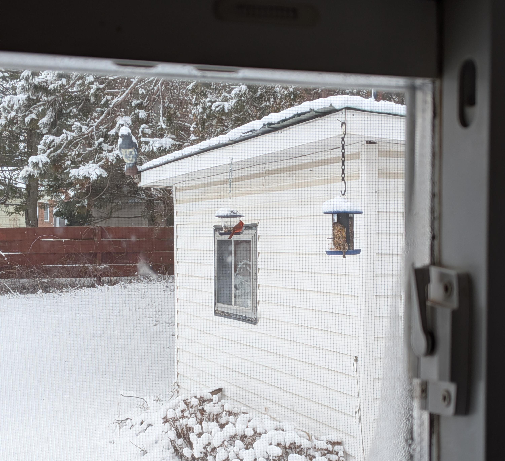
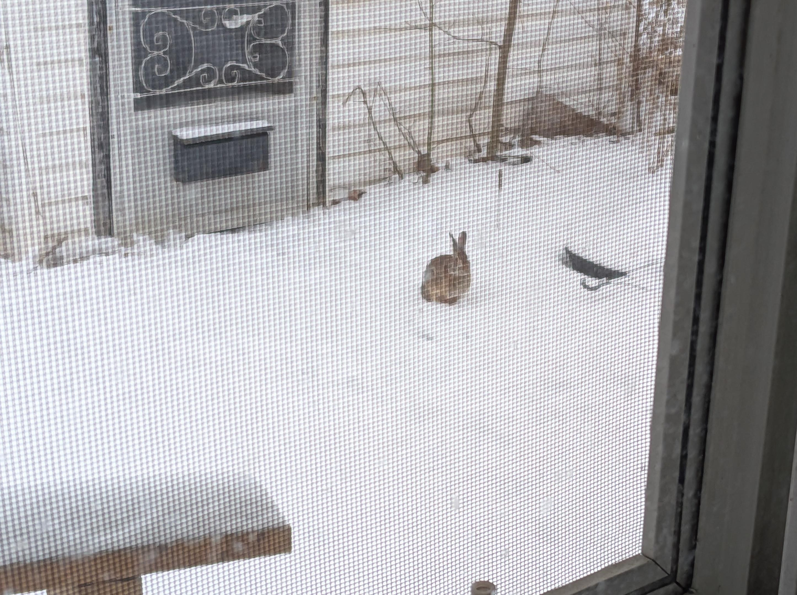

+++
title = "The Birds Are Back"
date = 2026-03-19
+++

There are two birds in this picture:

A small number have been around all winter, but activity has really
picked up again in the last week or so. The temptation is there to
assume there's a seasonal pattern for certain species like the grackles
(who spend a lot of time bullying others off of the blue feeder), and
there might be. There may also be some other place they like to be which
hasn't provided food for them recently (further research may confirm).
It seems that I was wrong about them not liking this mixed bird seed
too.

So far we've seen:

- Both cardinals
- Grackles
- Black-capped chickadees
- Some unrecognized small brown bird (House Wren or Eastern Phoebe,
  maybe)

On the ground, in addition to squirrels and the neighbourhood cats,
we've also had repeat visits from this one:

